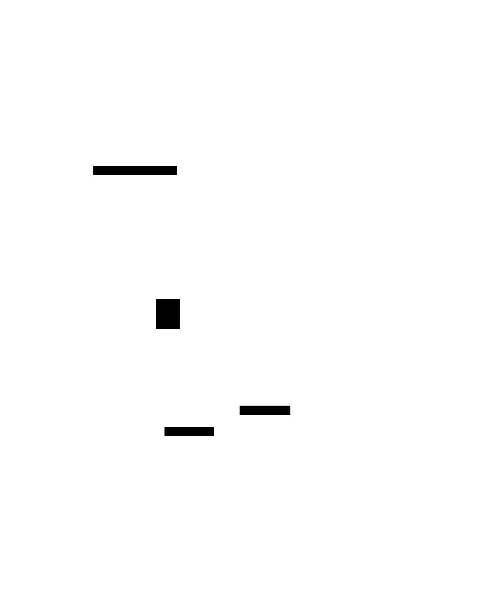

# Elgo - Elo matchmaking module in Go

  

Elgo is a relatively small package that provides a matchmaking pool and a simple calculator for ELO-like rating with configurable `K`-factor.

## How it works?

TLDR version:

## TODO list

- [ ] Add example explanation
- [ ] Add d2lang diagrams
- [ ] Add a git tag/version
- [ ] Add other pool types (non-elo based)
  - [ ] LIFO (Stack)
  - [ ] FIFO (Queue)
  - [ ] Other ...?
- [ ] Add an option to use this as a service
  - gRPC (does it even support channel-like streaming data type?)
  - as a docker container with sockets/grpc
